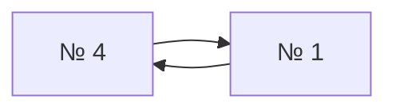

# Взаимные победы № 4 и № 1

N=16; seed=42; repeat=10; модель `elo`.

Графовый результат: **partial**. Причина: `Cycle remains after resolving head-to-head majorities`.
Сохранённая тройка: № 7 — место 1, № 13 — место 2, № 11 — место 3.

## Почему граф не смог завершить расстановку

После фиксации тройки среди непризёров остаётся цикл.
Стрелки здесь идут **от проигравшего к победителю**.



Бои, образующие этот цикл:

| Бой | Проигравший | Победитель |
|---:|---:|---:|
| 11 | № 4 | № 1 |
| 27 | № 1 | № 4 |

Все эти спортсмены вне призовой тройки. Её фиксация не удаляет цикл;
построение цепочек останавливается ещё до отбора длин L и L−1.

## Рейтинги и места

Минимум поражений — минимальный исходный рейтинг победившего спортсмена соперника;
максимум побед — максимальный исходный рейтинг побеждённого соперника.
При отказе графа непризёры сортируются по этим двум показателям по убыванию,
затем по порядку жеребьёвки. Тройка остаётся фиксированной.

| № | Исходный рейтинг | Минимум поражений | Максимум побед | Только граф | После сравнения |
|---:|---:|---:|---:|---:|---:|
| 1 | 1044.315422 | 884.604489 | 924.100952 | — | 6 |
| 2 | 424.526629 | 529.659935 | 545.433013 | — | 13 |
| 3 | 545.433013 | 424.526629 | 175.737114 | — | 14 |
| 4 | 884.604489 | 1044.315422 | 1044.315422 | — | 4 |
| 5 | 189.447068 | 84.724808 | 0 (нет побед) | — | 15 |
| 6 | 81.941973 | 73.070681 | 0 (нет побед) | — | 16 |
| 7 | 5731.386187 | нет поражений | 1402.623531 | 1 | 1 |
| 8 | 924.100952 | 1044.315422 | 424.526629 | — | 5 |
| 9 | 713.331282 | 884.604489 | 211.526199 | — | 8 |
| 10 | 175.737114 | 545.433013 | 0 (нет побед) | — | 12 |
| 11 | 1070.555526 | 1402.623531 | 924.100952 | 3 | 3 |
| 12 | 84.724808 | 884.604489 | 189.447068 | — | 9 |
| 13 | 1402.623531 | 5731.386187 | 1070.555526 | 2 | 2 |
| 14 | 73.070681 | 545.433013 | 81.941973 | — | 11 |
| 15 | 211.526199 | 713.331282 | 0 (нет побед) | — | 10 |
| 16 | 529.659935 | 884.604489 | 424.526629 | — | 7 |

## Полный журнал боёв

Жеребьёвка: 2, 3, 10, 8, 6, 16, 14, 11, 15, 1, 4, 9, 12, 5, 13, 7.

| Бой | Стадия | Победитель | Проигравший |
|---:|---|---:|---:|
| 1 | W1 | № 2 | № 3 |
| 2 | W1 | № 8 | № 10 |
| 3 | W1 | № 16 | № 6 |
| 4 | W1 | № 11 | № 14 |
| 5 | W1 | № 1 | № 15 |
| 6 | W1 | № 4 | № 9 |
| 7 | W1 | № 12 | № 5 |
| 8 | W1 | № 7 | № 13 |
| 9 | W2 | № 8 | № 2 |
| 10 | W2 | № 11 | № 16 |
| 11 | W2 | № 1 | № 4 |
| 12 | W2 | № 7 | № 12 |
| 13 | L1 | № 3 | № 10 |
| 14 | L1 | № 14 | № 6 |
| 15 | L1 | № 9 | № 15 |
| 16 | L1 | № 13 | № 5 |
| 17 | W3 | № 11 | № 8 |
| 18 | W3 | № 7 | № 1 |
| 19 | L1 | № 16 | № 2 |
| 20 | L1 | № 4 | № 12 |
| 21 | L2 | № 3 | № 14 |
| 22 | L2 | № 13 | № 9 |
| 23 | W4 | № 7 | № 11 |
| 24 | L2 | № 1 | № 8 |
| 25 | L2 | № 4 | № 16 |
| 26 | L3 | № 13 | № 3 |
| 27 | L3 | № 4 | № 1 |
| 28 | L4 | № 13 | № 4 |
| 29 | L5 | № 13 | № 11 |
| 30 | final | № 7 | № 13 |

## Воспроизведение

```bash
.venv/bin/python -m simulation.trace --participants 16 --seed 42 --repeat 10 --model elo
```

Команда покажет полную GS после каждого боя и итоговые места текущей версии.
Точные исходные данные для графового алгоритма: [01-mutual-cycle.json](01-mutual-cycle.json).
Рейтинги в JSON сохранены без округления; в таблице показаны шесть знаков.

[Все примеры](README.md)
