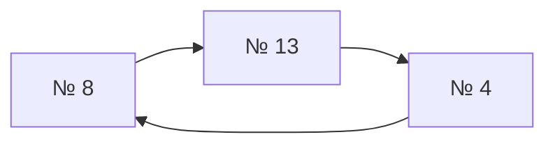

# Цикл № 8 → № 13 → № 4 → № 8

N=16; seed=42; repeat=2; модель `elo`.

Графовый результат: **partial**. Причина: `Cycle remains after resolving head-to-head majorities`.
Сохранённая тройка: № 9 — место 1, № 6 — место 2, № 2 — место 3.

## Почему граф не смог завершить расстановку

После фиксации тройки среди непризёров остаётся цикл.
Стрелки здесь идут **от проигравшего к победителю**.



Бои, образующие этот цикл:

| Бой | Проигравший | Победитель |
|---:|---:|---:|
| 12 | № 8 | № 13 |
| 24 | № 13 | № 4 |
| 27 | № 4 | № 8 |

Все эти спортсмены вне призовой тройки. Её фиксация не удаляет цикл;
построение цепочек останавливается ещё до отбора длин L и L−1.

## Рейтинги и места

Минимум поражений — минимальный исходный рейтинг победившего спортсмена соперника;
максимум побед — максимальный исходный рейтинг побеждённого соперника.
При отказе графа непризёры сортируются по этим двум показателям по убыванию,
затем по порядку жеребьёвки. Тройка остаётся фиксированной.

| № | Исходный рейтинг | Минимум поражений | Максимум побед | Только граф | После сравнения |
|---:|---:|---:|---:|---:|---:|
| 1 | 290.251757 | 687.491447 | 179.700509 | — | 7 |
| 2 | 918.297464 | 1157.787676 | 687.491447 | 3 | 3 |
| 3 | 124.893981 | 443.597168 | 0 (нет побед) | — | 11 |
| 4 | 616.551858 | 687.491447 | 700.935629 | — | 5 |
| 5 | 361.243805 | 344.417358 | 0 (нет побед) | — | 14 |
| 6 | 1157.787676 | 1269.247988 | 1269.247988 | 2 | 2 |
| 7 | 473.294486 | 402.995896 | 361.243805 | — | 12 |
| 8 | 687.491447 | 700.935629 | 616.551858 | — | 4 |
| 9 | 1269.247988 | 1157.787676 | 1157.787676 | 1 | 1 |
| 10 | 402.995896 | 687.491447 | 473.294486 | — | 6 |
| 11 | 443.597168 | 687.491447 | 124.893981 | — | 8 |
| 12 | 179.700509 | 290.251757 | 0 (нет побед) | — | 16 |
| 13 | 700.935629 | 616.551858 | 687.491447 | — | 9 |
| 14 | 336.749709 | 344.417358 | 318.962176 | — | 13 |
| 15 | 344.417358 | 616.551858 | 361.243805 | — | 10 |
| 16 | 318.962176 | 336.749709 | 0 (нет побед) | — | 15 |

## Полный журнал боёв

Жеребьёвка: 16, 6, 14, 10, 5, 7, 15, 4, 9, 2, 3, 11, 1, 8, 12, 13.

| Бой | Стадия | Победитель | Проигравший |
|---:|---|---:|---:|
| 1 | W1 | № 6 | № 16 |
| 2 | W1 | № 10 | № 14 |
| 3 | W1 | № 7 | № 5 |
| 4 | W1 | № 4 | № 15 |
| 5 | W1 | № 9 | № 2 |
| 6 | W1 | № 11 | № 3 |
| 7 | W1 | № 8 | № 1 |
| 8 | W1 | № 13 | № 12 |
| 9 | W2 | № 6 | № 10 |
| 10 | W2 | № 4 | № 7 |
| 11 | W2 | № 9 | № 11 |
| 12 | W2 | № 13 | № 8 |
| 13 | L1 | № 14 | № 16 |
| 14 | L1 | № 15 | № 5 |
| 15 | L1 | № 2 | № 3 |
| 16 | L1 | № 1 | № 12 |
| 17 | W3 | № 6 | № 4 |
| 18 | W3 | № 9 | № 13 |
| 19 | L1 | № 10 | № 7 |
| 20 | L1 | № 8 | № 11 |
| 21 | L2 | № 15 | № 14 |
| 22 | L2 | № 2 | № 1 |
| 23 | W4 | № 9 | № 6 |
| 24 | L2 | № 4 | № 13 |
| 25 | L2 | № 8 | № 10 |
| 26 | L3 | № 2 | № 15 |
| 27 | L3 | № 8 | № 4 |
| 28 | L4 | № 2 | № 8 |
| 29 | L5 | № 6 | № 2 |
| 30 | final | № 6 | № 9 |
| 31 | reset | № 9 | № 6 |

## Воспроизведение

```bash
.venv/bin/python -m simulation.trace --participants 16 --seed 42 --repeat 2 --model elo
```

Команда покажет полную GS после каждого боя и итоговые места текущей версии.
Точные исходные данные для графового алгоритма: [02-three-person-cycle.json](02-three-person-cycle.json).
Рейтинги в JSON сохранены без округления; в таблице показаны шесть знаков.

[Все примеры](README.md)
