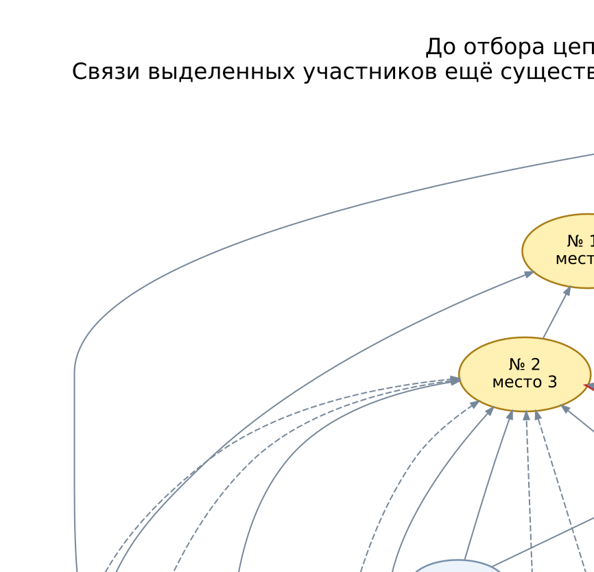
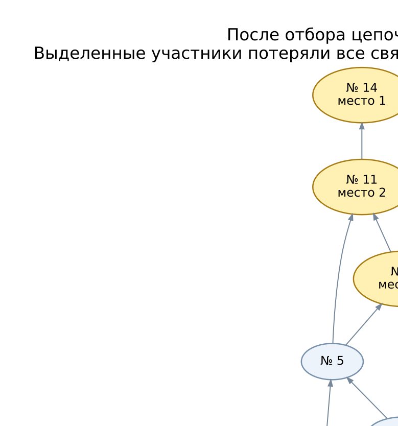

# Изолированный участник № 4

N=16; seed=42; repeat=0; модель `strong-win`.

Графовый результат: **partial**. Причина: `Graph must have exactly one source and include all participants`.
Сохранённая тройка: № 14 — место 1, № 11 — место 2, № 2 — место 3.

## Графические схемы

Стрелка: **проигравший → победитель**. Золотые вершины — призёры; красные — участники проблемного фрагмента. Сплошное ребро соответствует результату боя, пунктирное — дополнительному ограничению от фиксации тройки. Веса цепочек на схемах не показаны.

До отбора красным выделены связи, которые затем исчезнут. После отбора красные вершины с пунктирной границей изолированы. Оба графа показаны в одном направлении; рабочий граф после отбора развёрнут для сравнения.



[Скачать PNG до отбора](images/03-isolated-participant-before.png)



[Скачать PNG после отбора](images/03-isolated-participant-after.png)

## Почему граф не смог завершить расстановку

После отбора цепочек изолированы: № 4.
Источники полученного графа: № 14, № 4.
Источников больше одного, поэтому проверка графа останавливает расстановку.

Ниже все цепочки, содержащие изолированных участников. Направление —
от проигравшего к победителю; длина — количество участников в цепочке.
Граф уже содержит ограничения, добавленные фиксацией тройки:
не каждое ребро в этих цепочках означает реальный бой.

### Начальный участник № 3: L=8

Оставляются длины 8 и 7. Пример максимальной цепочки:

`3 → 1 → 9 → 13 → 5 → 2 → 11 → 14`

| Отброшенная цепочка | Длина |
|---|---:|
| 3 → 16 → 4 → 14 | 4 |
| 3 → 16 → 4 → 2 → 11 → 14 | 6 |

### Начальный участник № 12: L=9

Оставляются длины 9 и 8. Пример максимальной цепочки:

`12 → 8 → 1 → 9 → 13 → 5 → 2 → 11 → 14`

| Отброшенная цепочка | Длина |
|---|---:|
| 12 → 4 → 14 | 3 |
| 12 → 4 → 2 → 11 → 14 | 5 |

Все пути через указанных участников короче порога. Участники остаются
вершинами графа, но все их связи исчезают. В исходном журнале бои сохранены.

## Рейтинги и места

Минимум поражений — минимальный исходный рейтинг победившего спортсмена соперника;
максимум побед — максимальный исходный рейтинг побеждённого соперника.
При отказе графа непризёры сортируются по этим двум показателям по убыванию,
затем по порядку жеребьёвки. Тройка остаётся фиксированной.

| № | Исходный рейтинг | Минимум поражений | Максимум побед | Только граф | После сравнения |
|---:|---:|---:|---:|---:|---:|
| 1 | 841.816294 | 971.648675 | 556.262488 | — | 10 |
| 2 | 1848.126601 | 1926.749895 | 1789.387671 | 3 | 3 |
| 3 | 450.977680 | 647.979940 | 0 (нет побед) | — | 14 |
| 4 | 1400.168472 | 1848.126601 | 647.979940 | — | 5 |
| 5 | 1789.387671 | 1848.126601 | 1648.358428 | — | 4 |
| 6 | 612.684561 | 971.648675 | 370.226407 | — | 11 |
| 7 | 538.340998 | 971.648675 | 0 (нет побед) | — | 12 |
| 8 | 556.262488 | 841.816294 | 522.985648 | — | 13 |
| 9 | 971.648675 | 1648.358428 | 841.816294 | — | 8 |
| 10 | 1556.358417 | 1789.387671 | 841.816294 | — | 7 |
| 11 | 1926.749895 | 2993.212680 | 1848.126601 | 2 | 2 |
| 12 | 522.985648 | 556.262488 | 0 (нет побед) | — | 16 |
| 13 | 1648.358428 | 1789.387671 | 971.648675 | — | 6 |
| 14 | 2993.212680 | нет поражений | 1926.749895 | 1 | 1 |
| 15 | 370.226407 | 612.684561 | 0 (нет побед) | — | 15 |
| 16 | 647.979940 | 1400.168472 | 450.977680 | — | 9 |

## Полный журнал боёв

Жеребьёвка: 1, 10, 16, 3, 8, 14, 4, 12, 11, 15, 6, 2, 13, 9, 7, 5.

| Бой | Стадия | Победитель | Проигравший |
|---:|---|---:|---:|
| 1 | W1 | № 10 | № 1 |
| 2 | W1 | № 16 | № 3 |
| 3 | W1 | № 14 | № 8 |
| 4 | W1 | № 4 | № 12 |
| 5 | W1 | № 11 | № 15 |
| 6 | W1 | № 2 | № 6 |
| 7 | W1 | № 13 | № 9 |
| 8 | W1 | № 5 | № 7 |
| 9 | W2 | № 10 | № 16 |
| 10 | W2 | № 14 | № 4 |
| 11 | W2 | № 11 | № 2 |
| 12 | W2 | № 5 | № 13 |
| 13 | L1 | № 1 | № 3 |
| 14 | L1 | № 8 | № 12 |
| 15 | L1 | № 6 | № 15 |
| 16 | L1 | № 9 | № 7 |
| 17 | W3 | № 14 | № 10 |
| 18 | W3 | № 11 | № 5 |
| 19 | L1 | № 4 | № 16 |
| 20 | L1 | № 2 | № 13 |
| 21 | L2 | № 1 | № 8 |
| 22 | L2 | № 9 | № 6 |
| 23 | W4 | № 14 | № 11 |
| 24 | L2 | № 5 | № 10 |
| 25 | L2 | № 2 | № 4 |
| 26 | L3 | № 9 | № 1 |
| 27 | L3 | № 2 | № 5 |
| 28 | L4 | № 2 | № 9 |
| 29 | L5 | № 11 | № 2 |
| 30 | final | № 14 | № 11 |

## Воспроизведение

```bash
.venv/bin/python -m simulation.trace --participants 16 --seed 42 --repeat 0 --model strong-win
```

Команда покажет полную GS после каждого боя и итоговые места текущей версии.
Точные исходные данные для графового алгоритма: [03-isolated-participant.json](03-isolated-participant.json).
Рейтинги в JSON сохранены без округления; в таблице показаны шесть знаков.

[Все примеры](README.md)
