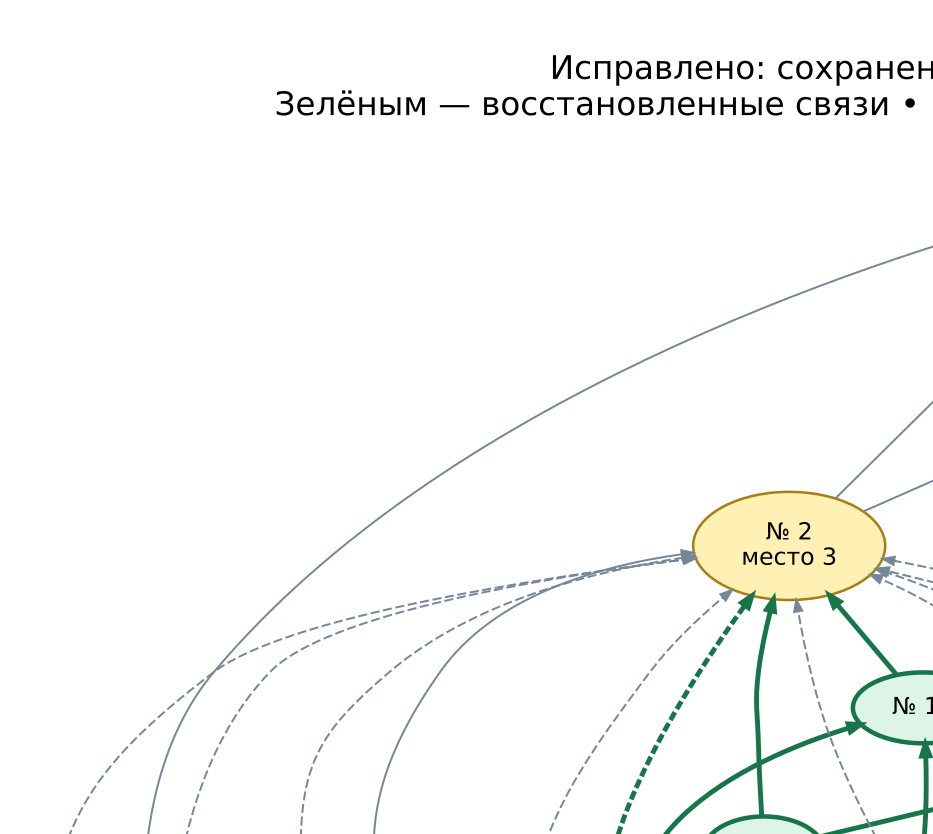
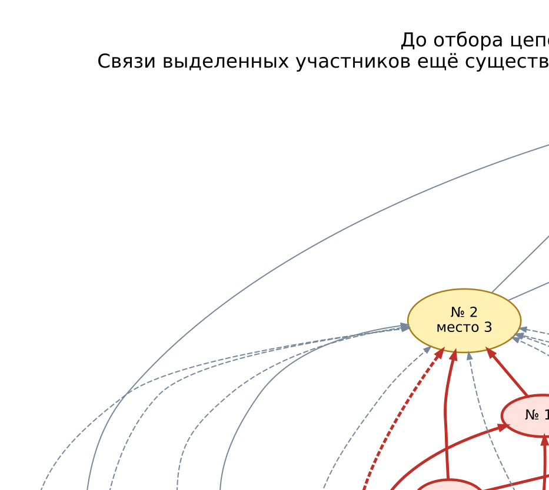
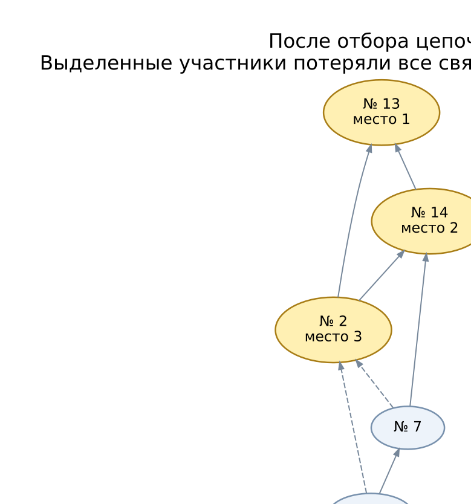

# Изолированные участники № 16, № 8 и № 9

> **Исправлено:** теперь сохраняются все ветви. Этот турнир полностью расставляется
> графовым алгоритмом без исходных рейтингов. Описание отброшенных цепочек и старые
> рисунки ниже сохранены как разбор прежнего поведения.

## Граф после исправления

Зелёным выделены ранее потерянные участники и их восстановленные связи.
Стрелки: проигравший → победитель; пунктирные рёбра — ограничения призовой тройки.



[PNG графа после исправления](images/04-isolated-group-restored.png)

Места теперь определены без рейтингов: № 13 — 1, № 14 — 2, № 2 — 3, № 7 — 4, № 12 — 5, № 15 — 6, № 16 — 7, № 9 — 8, № 6 — 9, № 8 — 10, № 11 — 11, № 3 — 12, № 5 — 13, № 1 — 14, № 10 — 15, № 4 — 16.


N=16; seed=42; repeat=24; модель `strong-win`.

Графовый результат **до исправления**: **partial**. Причина: `Graph must have exactly one source and include all participants`.
Сохранённая тройка: № 13 — место 1, № 14 — место 2, № 2 — место 3.

## Графические схемы

Стрелка: **проигравший → победитель**. Золотые вершины — призёры; красные — участники проблемного фрагмента. Сплошное ребро соответствует результату боя, пунктирное — дополнительному ограничению от фиксации тройки. Веса цепочек на схемах не показаны.

До отбора красным выделены связи, которые затем исчезнут. После отбора красные вершины с пунктирной границей изолированы. Оба графа показаны в одном направлении; рабочий граф после отбора развёрнут для сравнения.



[Скачать PNG до отбора](images/04-isolated-group-before.png)



[Скачать PNG после отбора](images/04-isolated-group-after.png)

## Почему прежний граф не смог завершить расстановку

После отбора цепочек изолированы: № 16, № 8, № 9.
Источники полученного графа: № 16, № 8, № 9, № 13.
Источников больше одного, поэтому проверка графа останавливает расстановку.

Ниже все цепочки, содержащие изолированных участников. Направление —
от проигравшего к победителю; длина — количество участников в цепочке.
Граф уже содержит ограничения, добавленные фиксацией тройки:
не каждое ребро в этих цепочках означает реальный бой.

### Начальный участник № 4: L=9

Оставляются длины 9 и 8. Пример максимальной цепочки:

`4 → 3 → 6 → 15 → 12 → 7 → 2 → 14 → 13`

| Отброшенная цепочка | Длина |
|---|---:|
| 4 → 8 → 16 → 2 → 13 | 5 |
| 4 → 8 → 16 → 2 → 14 → 13 | 6 |
| 4 → 8 → 16 → 14 → 13 | 5 |
| 4 → 8 → 9 → 2 → 13 | 5 |
| 4 → 8 → 9 → 2 → 14 → 13 | 6 |
| 4 → 8 → 9 → 7 → 14 → 13 | 6 |
| 4 → 8 → 9 → 7 → 2 → 13 | 6 |
| 4 → 8 → 9 → 7 → 2 → 14 → 13 | 7 |
| 4 → 8 → 2 → 13 | 4 |
| 4 → 8 → 2 → 14 → 13 | 5 |
| 4 → 3 → 16 → 2 → 13 | 5 |
| 4 → 3 → 16 → 2 → 14 → 13 | 6 |
| 4 → 3 → 16 → 14 → 13 | 5 |

### Начальный участник № 1: L=8

Оставляются длины 8 и 7. Пример максимальной цепочки:

`1 → 6 → 15 → 12 → 7 → 2 → 14 → 13`

| Отброшенная цепочка | Длина |
|---|---:|
| 1 → 9 → 2 → 13 | 4 |
| 1 → 9 → 2 → 14 → 13 | 5 |
| 1 → 9 → 7 → 14 → 13 | 5 |
| 1 → 9 → 7 → 2 → 13 | 5 |
| 1 → 9 → 7 → 2 → 14 → 13 | 6 |

Все пути через указанных участников короче порога. Участники остаются
вершинами графа, но все их связи исчезают. В исходном журнале бои сохранены.

## Рейтинги и места до исправления

Минимум поражений — минимальный исходный рейтинг победившего спортсмена соперника;
максимум побед — максимальный исходный рейтинг побеждённого соперника.
При отказе графа непризёры сортируются по этим двум показателям по убыванию,
затем по порядку жеребьёвки. Тройка остаётся фиксированной.

| № | Исходный рейтинг | Минимум поражений | Максимум побед | Только граф | После сравнения |
|---:|---:|---:|---:|---:|---:|
| 1 | 471.155880 | 640.389841 | 0 (нет побед) | — | 14 |
| 2 | 1653.225569 | 1786.037092 | 689.837035 | 3 | 3 |
| 3 | 412.565752 | 640.389841 | 127.188679 | — | 13 |
| 4 | 127.188679 | 412.565752 | 0 (нет побед) | — | 16 |
| 5 | 449.077965 | 989.345795 | 0 (нет побед) | — | 11 |
| 6 | 640.389841 | 989.345795 | 471.155880 | — | 9 |
| 7 | 1290.063976 | 1786.037092 | 1130.224793 | — | 4 |
| 8 | 426.576611 | 647.348221 | 127.188679 | — | 12 |
| 9 | 689.837035 | 1290.063976 | 471.155880 | — | 7 |
| 10 | 400.053016 | 454.135094 | 0 (нет побед) | — | 15 |
| 11 | 454.135094 | 989.345795 | 400.053016 | — | 10 |
| 12 | 1130.224793 | 1290.063976 | 989.345795 | — | 6 |
| 13 | 6022.792015 | нет поражений | 1786.037092 | 1 | 1 |
| 14 | 1786.037092 | 6022.792015 | 1653.225569 | 2 | 2 |
| 15 | 989.345795 | 1130.224793 | 640.389841 | — | 8 |
| 16 | 647.348221 | 1653.225569 | 426.576611 | — | 5 |

## Полный журнал боёв

Жеребьёвка: 3, 16, 8, 4, 2, 6, 1, 9, 5, 13, 15, 12, 11, 14, 7, 10.

| Бой | Стадия | Победитель | Проигравший |
|---:|---|---:|---:|
| 1 | W1 | № 16 | № 3 |
| 2 | W1 | № 8 | № 4 |
| 3 | W1 | № 2 | № 6 |
| 4 | W1 | № 9 | № 1 |
| 5 | W1 | № 13 | № 5 |
| 6 | W1 | № 12 | № 15 |
| 7 | W1 | № 14 | № 11 |
| 8 | W1 | № 7 | № 10 |
| 9 | W2 | № 16 | № 8 |
| 10 | W2 | № 2 | № 9 |
| 11 | W2 | № 13 | № 12 |
| 12 | W2 | № 14 | № 7 |
| 13 | L1 | № 3 | № 4 |
| 14 | L1 | № 6 | № 1 |
| 15 | L1 | № 15 | № 5 |
| 16 | L1 | № 11 | № 10 |
| 17 | W3 | № 2 | № 16 |
| 18 | W3 | № 13 | № 14 |
| 19 | L1 | № 9 | № 8 |
| 20 | L1 | № 7 | № 12 |
| 21 | L2 | № 6 | № 3 |
| 22 | L2 | № 15 | № 11 |
| 23 | W4 | № 13 | № 2 |
| 24 | L2 | № 14 | № 16 |
| 25 | L2 | № 7 | № 9 |
| 26 | L3 | № 15 | № 6 |
| 27 | L3 | № 14 | № 7 |
| 28 | L4 | № 14 | № 15 |
| 29 | L5 | № 14 | № 2 |
| 30 | final | № 13 | № 14 |

## Воспроизведение

```bash
.venv/bin/python -m simulation.trace --participants 16 --seed 42 --repeat 24 --model strong-win
```

Команда покажет полную GS после каждого боя и итоговые места текущей версии.
Точные исходные данные для графового алгоритма: [04-isolated-group.json](04-isolated-group.json).
Рейтинги в JSON сохранены без округления; в таблице показаны шесть знаков.

[Все примеры](README.md)
