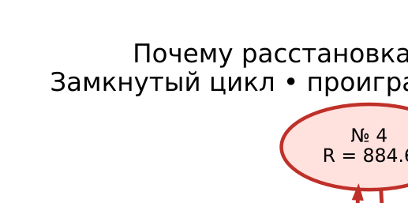
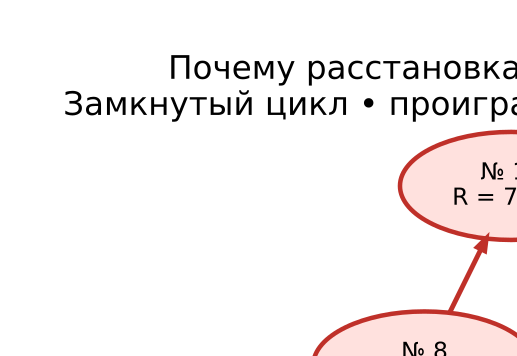
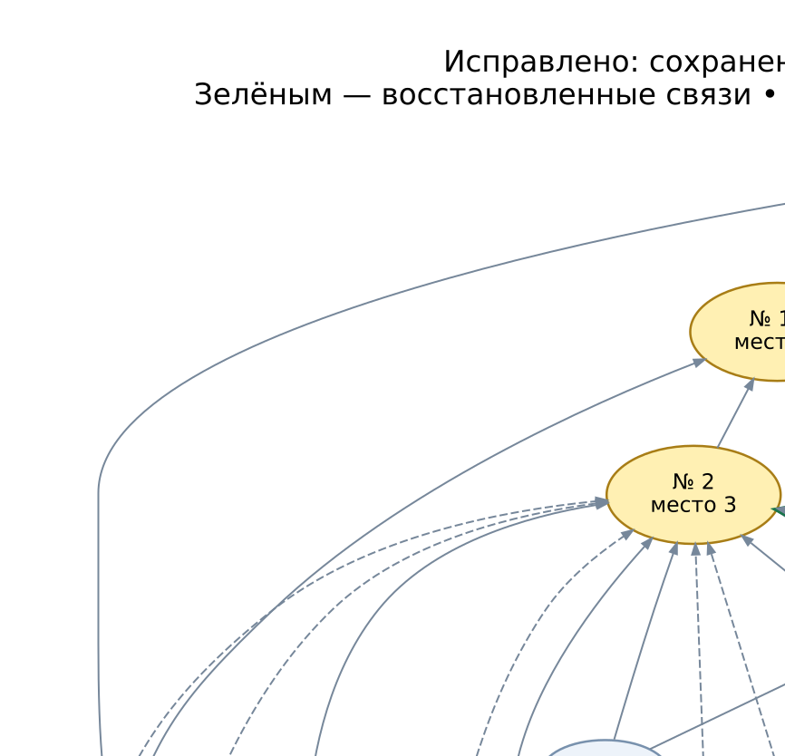

# Примеры отказа графового алгоритма Гринёва

Четыре воспроизведённых турнира из последней серии `results/de-old-fix/n16/`.
Во всех случаях N=16, seed=42; сетка — DE_OLD_fix.
Ревизия исходного эксперимента: `776f9c4fd16fc489e897073f4b46dccf4982053b`.

**После исправления два примера с изоляцией расставляются целиком графовым
алгоритмом без рейтингов.** На новых схемах восстановленные ветви выделены зелёным.
Старые схемы и цепочки сохранены для сравнения. JSON содержит `graph_only`
и `final_places` для текущей версии, а поля с суффиксом `_before_branch_fix` —
исторические результаты. Циклы в первых двух примерах остаются после стандартного прохода.
Дополнительный метод разрешает их по трём критериям без исходных рейтингов;
в каждом примере показаны временный и итоговый графы и таблица баллов.

В документах и JSON-примерах номера спортсменов **1…N** (ID из CSV + 1).
`repeat` оставлен с нуля, как в артефактах. Причины отказа получены повторным
вызовом `rank_tournament(names, pairs)` без рейтингов.

| Пример | Модель | repeat | Проблема |
|---|---|---:|---|
| [Взаимные победы № 4 и № 1](01-mutual-cycle.md) | elo | 10 | Цикл |
| [Цикл № 8 → № 13 → № 4 → № 8](02-three-person-cycle.md) | elo | 2 | Цикл |
| [Изолированный участник № 4](03-isolated-participant.md) | strong-win | 0 | Потеря связей |
| [Изолированные участники № 16, № 8 и № 9](04-isolated-group.md) | strong-win | 24 | Потеря связей |

Каждый пример содержит причину, схему цикла или отброшенные цепочки,
исходные рейтинги, весь журнал боёв, места до/после сравнения и JSON с точными данными.

Проверка графового отказа по любому JSON-примеру:

```python
import json
from pathlib import Path
from armplaces.topological_sort import rank_tournament

case = json.loads(Path("docs/grintour-examples/01-mutual-cycle.json").read_text())
names = dict(enumerate(case["draw"]))
assert rank_tournament(names, case["pairs"]) == case["graph_only"]
result = rank_tournament(names, case["pairs"], ratings=case["ratings"])
assert result["status"] == "ok"
assert result["places"] == case["final_places"]
```

## Галерея

Стрелка: **проигравший → победитель**. Золотые вершины — призёры; красные — участники проблемного фрагмента. Сплошное ребро соответствует результату боя, пунктирное — дополнительному ограничению от фиксации тройки. Веса цепочек на схемах не показаны.

### Взаимные победы

[Полный разбор и графы](01-mutual-cycle.md)



### Цикл из трёх участников

[Полный разбор и графы](02-three-person-cycle.md)



### Один изолированный участник

[Полный разбор и графы](03-isolated-participant.md)



### Три изолированных участника

[Полный разбор и графы](04-isolated-group.md)


## Перестроить изображения

Требуется установленный Graphviz (`dot`). Python запускается из проектного окружения:

```bash
.venv/bin/python scripts/render_grintour_examples.py
```

Скрипт читает точные JSON-примеры, проверяет причины отказа и формирует SVG и PNG.
Для циклов показаны полный граф после фиксации призёров и увеличенный фрагмент.
Для прежней изоляции показаны графы до отбора, после старого отбора и после исправления.
